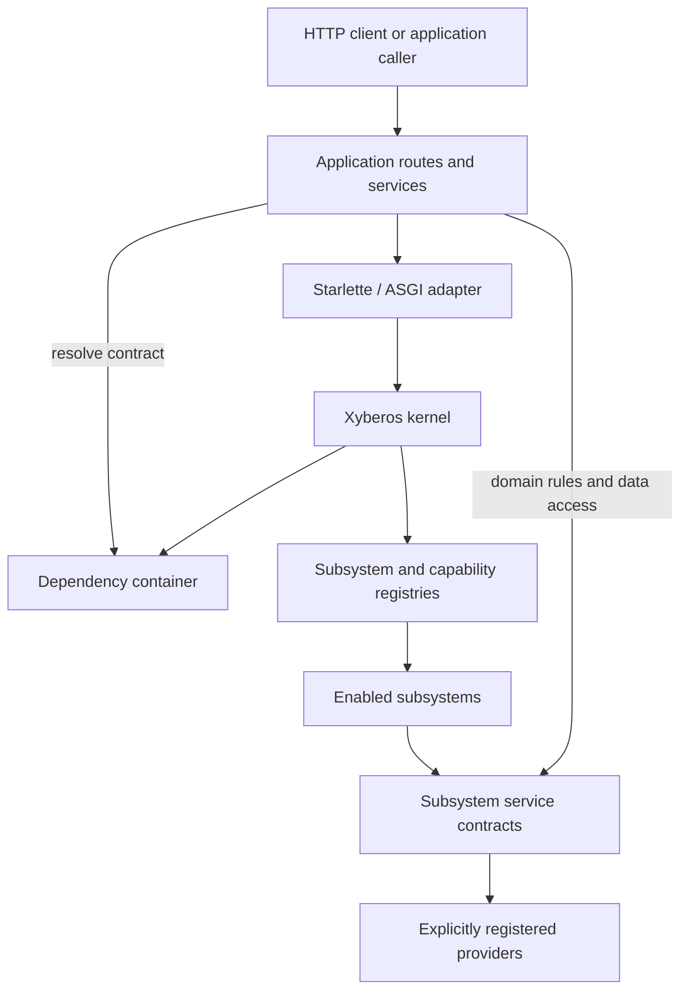
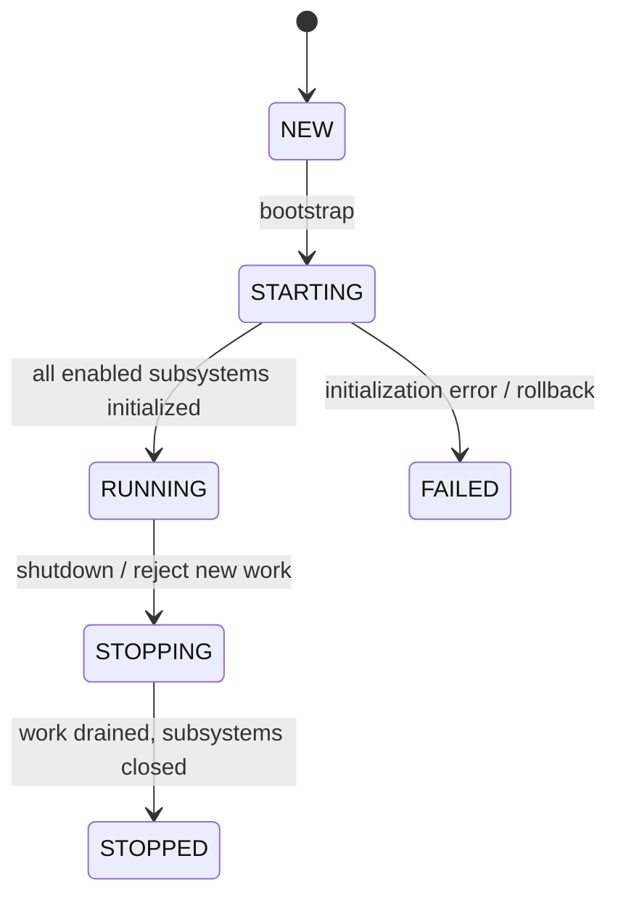

# Xyberos 2.0 — Architecture Review

Engineering-oriented description of the implementation in this repository.
This document describes what exists today; it is not a target-state specification
or a claim of production readiness.

## 1. System purpose and boundaries

Xyberos is a Python application foundation built around an explicit async kernel,
an ASGI adapter, optional subsystems, and replaceable providers. It coordinates
application lifecycle and selected cross-cutting concerns; it is not intended to
replace a web framework, database, workflow platform, AI orchestration stack, or
complete messaging network.

The kernel owns lifecycle, registries, dependency resolution, execution context,
capability authorization, in-process events, health state, and tracked-work
draining. Application code owns routes, authentication, business rules, resource
authorization, schema definitions, and decisions about which optional components
to register. Subsystems adapt service contracts to the kernel lifecycle. Providers
implement those contracts against concrete technologies.



Provider and subsystem registration is explicit. The runtime does not scan for or
execute arbitrary plugins. A provider is selected through subsystem configuration
and must be among the implementations supplied to that subsystem by the
application.

## 2. Package responsibilities

| Package | Responsibility |
| --- | --- |
| `xyberos.kernel` | Lifecycle state, configuration, registries, dependency container, execution context, capability execution, policy contract, events, health and observer hooks. |
| `xyberos.http` | Starlette/ASGI adapters for trusted identity context, kernel admission, and health/readiness routes. |
| `xyberos.subsystems` | Service contracts and lifecycle adapters for database, flows, AI, memory, knowledge, blob storage, and P2P. |
| `xyberos.providers` | Concrete implementations such as SQLite/PostgreSQL, local filesystem, in-memory stores, OpenAI-compatible model access, and P2P transports/stores. |
| `apps` | Composition roots and examples. These wire the kernel, providers, policies, routes, and application-specific data rules. |

The top-level `xyberos` package exposes a deliberately small root API. Most
subsystem and provider use should import the relevant module explicitly rather
than treating every internal class as a stable package-level contract.

## 3. Runtime and lifecycle

`XyberosKernel` starts in `NEW`, transitions through `STARTING` to `RUNNING`,
then enters `STOPPING` and `STOPPED`. Startup configuration determines which
registered subsystems are enabled. Enabled subsystems initialize in configuration
iteration order and receive their settings and the shared dependency container.
If initialization fails, already initialized subsystems are shut down in reverse
order and the kernel becomes `FAILED`.

Shutdown stops admission of new tracked work, waits for active work up to the
configured drain timeout (30 seconds by default), and then shuts initialized
subsystems down in reverse order. Shutdown failures are collected and reported as
a subsystem shutdown error. A drain timeout is reported rather than silently
cancelling arbitrary work. Applications must arrange their ASGI server and
orchestrator grace period accordingly.



`kernel.work()` tracks admitted operations, and `execute_capability()` uses that
tracking boundary. The HTTP admission middleware separately tracks each
non-health HTTP request. These are two distinct integration points: a direct
service call is not automatically wrapped in `kernel.work()` unless its caller
or adapter provides that behavior.

The kernel exposes lifecycle-derived liveness and readiness. Readiness probes are
application-supplied, async, and individually time-bounded; there is no automatic
dependency discovery. Observer hooks report subsystem initialization and
shutdown events. Observer exceptions are logged and counted without changing
the underlying lifecycle operation.

## 4. Composition and dependency resolution

Applications construct providers and subsystem adapters, register them before
bootstrap, and provide subsystem configuration under `xyberos.subsystems`. A
subsystem selects one registered provider by name, initializes it, and normally
registers the public service contract in `DependencyContainer`. On shutdown it
closes the provider and unregisters that service.

The container is a small explicit interface-to-instance map, not an
auto-construction or scope-management framework. The application decides object
lifetimes and registration order. Policy engines are also registered by the
application; a default allow policy is not assumed.

Typical composition:

1. Create the provider and subsystem instances.
2. Register provider and subsystem instances on the kernel.
3. Register application services, policy implementations, and capabilities.
4. Bootstrap the kernel.
5. Start the ASGI server or invoke services.
6. Shut down the kernel from the application lifespan hook.

See the CRUD app composition root in
[`apps/example_crud_app/app.py`](apps/example_crud_app/app.py).

## 5. Request context and authorization

### 5.1 Establishing context

`XyberosContextMiddleware` asks an application-provided `IdentityResolver` to
authenticate the request. The resolver must return `AuthenticatedIdentity` or
`None`; absence of a resolver or identity returns HTTP 401. Middleware constructs
an immutable `ExecutionContext` containing request, actor, tenant, and request
metadata, installs it in a `ContextVar` for the async scope, and resets it in a
`finally` block. A syntactically safe supplied request ID is reused; otherwise a
new ID is generated and returned in the response.

Caller-controlled tenant or actor headers are not identity sources. The trusted
resolver is the authentication boundary. The included demo identity mapping is
for local development only.

### 5.2 Capability authorization

Capabilities are named descriptors with an authentication requirement, paired
with explicitly registered handlers. `kernel.execute_capability()` resolves the
descriptor and handler, requires a valid execution context, checks non-empty
actor and tenant values when authentication is required, resolves the registered
`PolicyEngine`, and invokes the handler only if the policy returns the boolean
`True`.

The capability executor is an explicit guarded-operation path, not an automatic
wrapper around routes or services. Direct calls to a handler, database, provider,
or subsystem API do not implicitly pass through capability authorization.

### 5.3 Domain authorization remains application-owned

`ExecutionContext` records trusted execution facts; it is not an authorization
decision. Applications must still check access to each tenant-owned object and
enforce business rules at the service or data-access boundary. The CRUD example
uses parameterized SQL and includes the authenticated tenant in every item query.
An application should not rely only on a route-level authentication check to
prevent cross-tenant access.

## 6. HTTP adapter and application request path

The HTTP package supplies reusable Starlette middleware and health route
constructors; applications define actual routes and schemas. A typical protected
request passes through:

1. Kernel admission middleware rejects non-health requests while the kernel is
   not running or is draining.
2. Context middleware obtains a trusted identity and installs its execution
   context.
3. The route validates request input and applies application rules.
4. The route/service resolves a subsystem contract, applies resource/tenant
   scoping, and returns an HTTP response.
5. Context and admission tracking are cleaned up as the request exits.

Health routes are excluded from ordinary admission and identity checks. Liveness
reports kernel lifecycle; readiness additionally runs only configured probes and
reports bounded dependency status without returning probe exception text.

Middleware composition and the order of custom middleware are part of the
application's integration responsibility. The included app demonstrates the
intended composition and should be treated as a pattern, not as a complete
authentication system.

## 7. Subsystem and provider architecture

Subsystems group optional service capabilities behind contracts. They own
initialization and cleanup, while provider implementations perform technology-
specific work. The kernel does not require every subsystem to be enabled.

| Capability | Current implementation shape | Important boundary |
| --- | --- | --- |
| Database | Async database contract; SQLite default and optional PostgreSQL provider. | Application owns SQL, schema, tenant predicates, and migration scheduling. |
| Flows | Sequential typed flow engine with conditions, retry/timeout handling, concurrency limits, and trace hooks. | Flows are optional orchestration; ordinary application code remains appropriate for simple operations. |
| AI | Model provider contract and configured provider adapter; `AISubsystem` exposes a guarded provider. | Generation requires trusted actor/tenant context and application-supplied policy approval. Model output remains untrusted input. |
| Memory and knowledge | Optional provider contracts with bounded in-memory/example providers. | Included in-memory and keyword implementations are not durable production retrieval systems. |
| Blob | Blob contract and local filesystem provider. | Local filesystem storage is not replicated cloud object storage. |
| P2P | Message/store/identity/transport contracts with local-first messaging and optional secure HTTPS relay components. | The transport foundation is not a complete managed messaging network. The application must expose and configure the relay and pairing explicitly. |

Provider interchangeability is bounded by the shared contract, configuration
compatibility, and application behavior. It does not imply that every backend is
operationally equivalent or that arbitrary provider-specific features are
portable.

### 7.1 Database and schema lifecycle

The example app uses SQLite with a serialized connection and worker-thread
operations. PostgreSQL support is an optional extra. `SchemaMigrator` applies an
ordered, forward-only migration history and stores applied versions in a ledger.
For production deployment, migrations should run as a single pre-deployment job;
the example's automatic migration mode is a local convenience.

### 7.2 AI policy boundary

The guarded model provider requires a trusted `ExecutionContext`, non-empty
actor and tenant identifiers, and a policy engine registered by the application.
The policy receives the `ai.generate` capability and provider/model resource
metadata before the underlying provider is called. This guards model generation;
it does not make prompts or responses trustworthy and does not authorize
downstream actions.

### 7.3 P2P application boundary

The raw local messaging service is distinct from
`TenantScopedMessagingService`. The tenant-scoped wrapper requires the active
execution context's tenant to match the requested tenant, requires explicit
tenant configuration, and checks the allowed conversation and peer mappings
before list/send/synchronize operations. Its authorization configuration is
application-supplied; it is not a dynamic identity federation or central
authorization service.

The relay protocol is early-stage: it routes and stores append-only ciphertext
and sees routing metadata. Current documented limitations include no dynamic
device discovery, group messaging, key rotation/recovery, delivery receipts,
relay deletion, relay rate limits, managed retention, or encryption at rest for
local device message storage. See the
[preliminary P2P threat model](docs/p2p-threat-model.md) for trust boundaries and
open decisions; it is not an independent cryptographic review.

## 8. Cross-cutting behavior

### Events

The kernel event bus is in-process. It dispatches to subscribed handlers
sequentially and awaits async handlers. It is not a durable queue, distributed
event log, or retrying message broker.

### Observability

The kernel provides standard logging, lifecycle health state, optional lifecycle
observer events, and an observer failure counter. The HTTP health adapter exposes
liveness and readiness. Applications remain responsible for request metrics,
distributed tracing, log shipping, and domain-specific audit records.

### Errors and cleanup

Startup failures trigger reverse-order cleanup of subsystems already initialized.
Shutdown continues across subsystem cleanup errors and reports collected failures
afterward. HTTP routes and application services are responsible for translating
expected domain errors into suitable responses; unexpected failures should remain
visible to normal server error handling and logging.

## 9. Security model and review notes

Security depends on keeping trust transitions explicit:

- Authentication belongs in an application-controlled identity resolver.
- The execution context must be created from trusted authentication output, not
  caller-supplied identity claims.
- Policies authorize registered capabilities; they do not replace
  tenant/resource checks in application code.
- AI is policy-gated, but model input/output is still untrusted.
- P2P app-level scoping complements, but does not replace, cryptographic peer
  identity, key management, secure transport configuration, or operational
  controls.
- Secrets and production credentials belong in protected runtime configuration,
  not source code or logs.
- Health probes should be bounded and side-effect-free.

This architecture makes control flow and policy hooks visible. It also means
applications must wire those hooks correctly; using the kernel does not
automatically secure every service call.

## 10. Operational assumptions and known limitations

- Run behind a maintained ASGI server and trusted TLS termination in deployed
  environments. Trust forwarded headers only from known proxies.
- Configure real authentication and authorization before exposing protected
  routes. The example static token mapping is intentionally local-only.
- Define bounded readiness probes for dependencies required to serve traffic.
  The kernel does not discover dependencies automatically.
- Configure orchestrator shutdown grace longer than the kernel's drain timeout
  plus provider cleanup time. Arbitrary background work is not forcibly cancelled.
- Use a single migration job per deployment and maintain tested backup/restore
  procedures; the project does not automate backups.
- Validate database/provider SQL compatibility and optional dependency behavior
  for the deployment target.
- Treat in-memory memory/knowledge providers and local blob storage according to
  their limited durability and scaling characteristics.
- Treat P2P as an early protocol foundation until the documented retention,
  rate-limit, local-storage, and key lifecycle gaps are addressed.

For concrete operating procedures, see
[`docs/deployment.md`](docs/deployment.md). For the beginner application
walkthroughs, see [`TUTORIAL.md`](TUTORIAL.md). For product tradeoffs and
ecosystem comparisons, see [`REVIEW.md`](REVIEW.md).

## 11. Testing strategy

The repository uses `unittest` tests for focused kernel, middleware, subsystem,
provider, application, and security-boundary behavior. PostgreSQL integration
coverage requires its configured test database; AI and P2P relay tests may have
optional-provider prerequisites. CI additionally runs linting, focused static
type checking, dependency auditing, and the test suite.

For a subsystem or provider change, maintain separate coverage for:

1. Contract behavior independent of a concrete backend.
2. Provider-specific behavior and resource cleanup.
3. Application-level authorization and tenant isolation.
4. Startup failure rollback and orderly shutdown where lifecycle is involved.
5. Optional dependencies and unavailable external services.

Run the repository's documented suite with:

```powershell
python -m unittest discover -s tests -p "test_*.py"
```

See [`README.md`](README.md) for installation requirements and
[`docs/implementation.md`](docs/implementation.md) for phase history and
remaining implementation scope.
